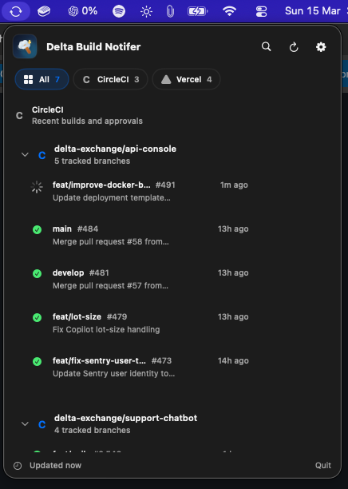

# Build Notifier

Build Notifier is a native macOS menu bar app for tracking CircleCI builds and Vercel deployments without keeping dashboards open.

## What It Does

- Watches CircleCI projects for passing, failing, running, and approval-required workflows
- Watches Vercel projects for deployment ready and deployment error states
- Sends native macOS notifications with optional sound
- Supports launch at login and per-project watch preferences
- Stores CircleCI and Vercel tokens locally for repeat use

## Screenshots

### Menu Bar Overview



## Requirements

- macOS 14+
- Swift 5.9+ or Xcode 15+ to build locally
- CircleCI personal API token and/or Vercel access token

## Generate Tokens

### CircleCI Personal API Token

1. Sign in to CircleCI.
2. Open the personal token page: [app.circleci.com/settings/user/tokens](https://app.circleci.com/settings/user/tokens)
3. Click `Create New Token`, give it a label, and copy the token when CircleCI shows it.
4. Paste the token into Build Notifier during onboarding or from Settings.

Reference: [CircleCI personal API token guide](https://circleci.com/docs/guides/permissions-authentication/personal-api-tokens/)

### Vercel Access Token

1. Sign in to Vercel.
2. Open the token page: [vercel.com/account/settings/tokens](https://vercel.com/account/settings/tokens)
3. Create a new token for the account or team that owns the projects you want to watch.
4. Copy the token and paste it into Build Notifier during onboarding or from Settings.

Reference: [Vercel access token guide](https://vercel.com/guides/how-do-i-use-a-vercel-api-access-token)

## Install

### DMG

1. Download or open the `.dmg`
2. Drag `Build Notifier.app` to `Applications`
3. Launch the app

This repository currently builds an ad-hoc signed, non-notarized app. On some Macs, first launch may be blocked until the user does one of the following:

1. Control-click `Build Notifier.app`, choose `Open`, then confirm `Open`
2. Or try to launch it once, then go to `System Settings > Privacy & Security` and click `Open Anyway`

### Sharing a DMG Built on This Machine

Yes, other people can install a DMG generated from this Mac.

What matters is how the app is signed:

- `./build-app.sh` signs the app ad hoc by default
- `./build-dmg.sh` packages that app into a DMG
- Ad-hoc signing is enough for sharing internally, but it is not the same as Developer ID signing and notarization

To share it:

1. Build the DMG with `./build-dmg.sh`
2. Send the generated `Build-Notifier-1.0.1.dmg` file to the other person
3. They open the DMG and drag `Build Notifier.app` to `Applications`
4. If macOS blocks first launch, they use `Open` from the context menu or `System Settings > Privacy & Security > Open Anyway`

If you want a smoother install experience for anyone outside your team, sign the app with a Developer ID certificate and notarize it before distribution.

### Build Locally

```bash
git clone <repo-url>
cd build-notifier
./build-app.sh
open "Build Notifier.app"
```

To build with a local signing identity already installed in Keychain:

```bash
security find-identity -v -p codesigning
SIGN_IDENTITY="Apple Development: Your Name (TEAMID)" ./build-app.sh
```

This helps when each teammate builds on their own Mac. It does not replace Developer ID signing or notarization for shared distribution.

## Development

```bash
swift build
swift run
./build-app.sh
./build-dmg.sh
```

Important paths:

- `BuildNotifier/Views/` for SwiftUI screens
- `BuildNotifier/Services/` for CircleCI, Vercel, notifications, and polling
- `BuildNotifier/State/AppState.swift` for app-wide state
- `build-app.sh` and `build-dmg.sh` for packaging

## Notes

- CircleCI only returns projects the user follows.
- Vercel support is project-based and tracks deployments from watched projects.
- The app icon is bundled during `./build-app.sh` from `BuildNotifier/Assets/AppIcon.icns`.
